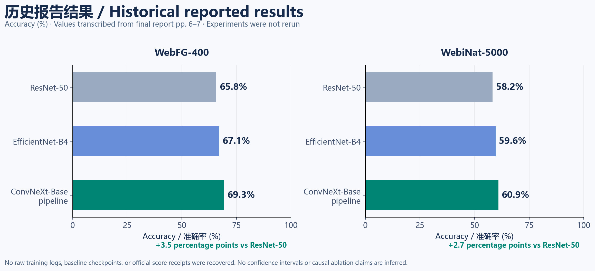
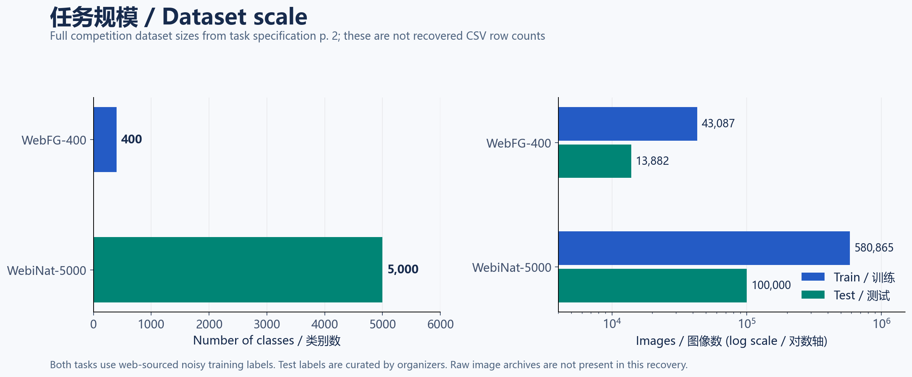
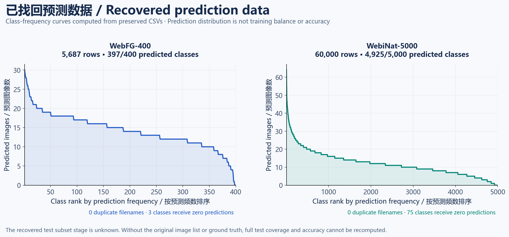
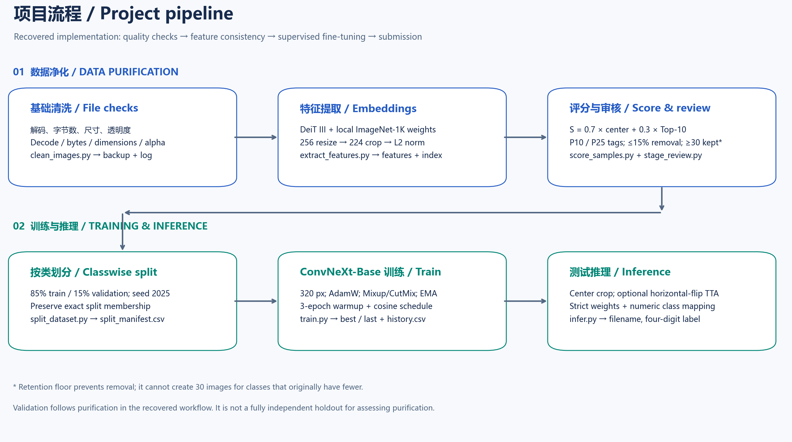
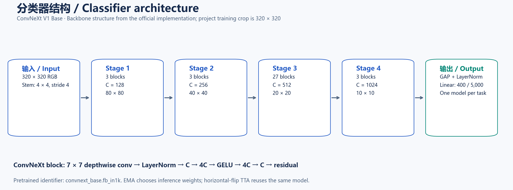

# Webly Supervised Fine-Grained Image Classification

[中文](README.zh-CN.md) · [Method](docs/METHODS.md) · [Run guide](docs/REPRODUCIBILITY.md) · [Evidence and history](docs/EVIDENCE.md)

An image classification project for **WebFG-400** and **WebiNat-5000**: clean web images, score their consistency within each assigned class, fine-tune an ImageNet-1K ConvNeXt-Base classifier, and generate competition prediction files.

The task is to distinguish similar aircraft, cars, birds, or species from images whose web-derived training labels may be incorrect. The project combines image quality checks with feature-based sample selection before supervised training.

This repository contains the recovered implementation and results, a portable maintenance version, and the course report. **The accuracy values below are historical report values; training was not rerun on the competition datasets.**

## Results

| Method in the final report | WebFG-400 accuracy | WebiNat-5000 accuracy |
|---|---:|---:|
| ResNet-50 | 65.8% | 58.2% |
| EfficientNet-B4 | 67.1% | 59.6% |
| ConvNeXt-Base pipeline | **69.3%** | **60.9%** |
| Difference from ResNet-50 | **+3.5 percentage points** | **+2.7 percentage points** |

Source: [final report, pp. 6–7](reports/final-report.zh-CN.pdf); [machine-readable metrics](results/metrics/report_metrics.csv). The report also records a **second prize in the 2025 provincial selection of the 7th Global Campus Artificial Intelligence Algorithm Elite Competition**. An award certificate and official score receipt were not included in the recovered materials.



The report does not identify the A/B test subset used for these results. Baseline training code, checkpoints, and per-run logs are absent. These comparisons therefore do not establish the isolated contribution of data purification.

## Tasks and data

| Dataset | Classes | Training images | Full test images | Subject matter |
|---|---:|---:|---:|---|
| WebFG-400 | 400 | 43,087 | 13,882 | Aircraft, cars, birds |
| WebiNat-5000 | 5,000 | 580,865 | 100,000 | Natural species |

Sizes come from the [competition specification, p. 2](reports/competition-task.zh-CN.pdf). Training labels are web-derived; test labels are manually curated by organizers. Competition subsets are sampled and anonymized from WebFG-496 and WebiNat-5089. Dataset access and the expected directory layout are documented in [data/README.md](data/README.md).



The recovered archive includes **two prediction CSVs**, not the original image datasets:

| Preserved CSV | Rows | Classes receiving predictions | Duplicate filenames |
|---|---:|---:|---:|
| [pred_results_web400.csv](results/predictions/pred_results_web400.csv) | 5,687 | 397 / 400 | 0 |
| [pred_results_web5000.csv](results/predictions/pred_results_web5000.csv) | 60,000 | 4,925 / 5,000 | 0 |

Each row contains `image_filename,four_digit_class_id`, without a header. All recovered labels are in range. CSV subset stage and full image coverage remain unknown. Predicted class frequencies describe model outputs, not dataset balance or accuracy.



## Implementation



The stages below describe inputs, operations, and outputs of the portable version in execution order. Parameters come from the recovered source; historical removal counts, split membership, and epoch logs are missing. Newly added run artifacts are identified below.

| Stage | Purpose | Script / configuration | Input to the next stage |
|---|---|---|---|
| 0. Preparation | Separate labels, working copies, and pretrained weights | [Data layout](data/README.md) | Class-folder images and local weights |
| 1. File checks | Reject unusable or undersized images | [clean_images.py](scripts/clean_images.py) | Working folder after file checks |
| 2. Features | Represent each image as a comparable visual vector | [extract_features.py](scripts/extract_features.py) | Feature matrix and aligned index |
| 3. Consistency scoring | Identify images unlike others in their assigned class | [score_samples.py](scripts/score_samples.py) | Scores, thresholds, kept/removed lists |
| 4. Review and removal | Preserve candidates and apply selection | [stage_review.py](scripts/stage_review.py) | Selected working folder and review copies |
| 5. Split | Build training and model-selection subsets | [split_dataset.py](scripts/split_dataset.py) | Train/val directories and manifest |
| 6. Training | Learn a 400-class or 5,000-class classifier | [train.py](scripts/train.py) · [configs/](configs) | Task weights and matching class map |
| 7. Inference | Convert test images into competition labels | [infer.py](scripts/infer.py) | Headerless two-column CSV |
| 8. Output audit | Check format, label range, and filename coverage | [validate_predictions.py](scripts/validate_predictions.py) | Format and coverage checks |

### 0. Prepare images and weights

Training images follow `<dataset_root>/<class_id>/<image_file>`: class-folder names supply the labels, and images sit directly inside each class folder. Test images occupy a flat directory with original competition filenames. Process and train the two tasks separately, retaining a separate class map for each.

Keep source images in `data/raw/` and process a copy under `data/working/`. Obtain two **ImageNet-1K pretrained checkpoints**: DeiT III for selection features and ConvNeXt-Base for classifier initialization. The extractor does not predict the final test labels, and its parameters are not transferred into the classifier. See [the data guide](data/README.md) for directory and checkpoint names.

### 1. File checks: determine whether an image is usable

Recursively collect images in the working directory and inspect them with parallel worker processes. Any matching rule makes the file a removal candidate:

| Check | Default rejection rule | Implementation |
|---|---|---|
| File size | Below 10,240 bytes (10 KiB) | Read file size first; undersized files are not decoded |
| Decoding | PIL cannot open or fully load the image | Decode the image rather than trusting its extension |
| Dimensions | Shortest side below 64 pixels | Read width/height and compare `min(width, height)` |
| Transparency | Under 5% of PNG/GIF pixels have nonzero alpha | Convert to RGBA and count `alpha > 0`; downsample large images and inspect the first GIF frame |

The portable version defaults to a dry run that prints matching paths and reasons. With `--apply`, it copies each candidate to a separate backup tree, preserving its relative path, before removing it from the working folder. `phase1_removed.csv` records source path, backup path, reason, and byte count. Feature extraction then reads the remaining working images.

These rules check input usability, not label correctness. The byte threshold can also reject valid, highly compressed images.

### 2. Feature extraction: represent each image numerically

1. Collect images in sorted class/path order and convert them to RGB. Skip decode failures and list them in `phase2_bad_images.csv`.
2. Bicubically resize the short side to **256**, center-crop to **224 × 224**, and convert pixels to tensors in the 0–1 range. Normalize channels with ImageNet mean `(0.485, 0.456, 0.406)` and standard deviation `(0.229, 0.224, 0.225)`.
3. Strictly load the local `deit3_base_patch16_224.fb_in1k` checkpoint and remove its 1,000-class head. Run in evaluation mode without updating weights, obtaining one feature vector per image.
4. L2-normalize each vector by dividing by its length, so subsequent comparisons use vector direction. Store float16 features by default; scoring converts them to float32 and normalizes them again.

`features.npy` has shape **M × D**, where M is the number of readable images and D the embedding dimension; the default DeiT III Base has D = 768. Row i of `index.csv` identifies feature row i by path, class ID, and class name. Never reorder one file independently of the other. These vectors drive selection; the final classifier is trained on images.

### 3. Consistency scoring: identify classwise outliers

Compare samples only within their assigned class rather than ranking absolute scores across classes. First require aligned feature/index lengths, unique paths, and finite values. Then calculate:

1. **Center score s₁:** average and normalize the class features, then compute each image's cosine similarity to that center. It measures agreement with the class's overall appearance. The image itself contributes to the center.
2. **Neighbor score s₂:** compute pairwise within-class cosine similarities, exclude self, and average the 10 largest values. It measures whether similar examples exist within the class. Use all other samples when fewer than 10 exist; a singleton receives a neighbor score of zero.
3. **Combined score:** `S = 0.7 × s₁ + 0.3 × s₂`. Compute the 10th and 25th percentiles P₁₀/P₂₅ separately for each class:

| Tag | Condition | Default action |
|---|---|---|
| `gray` | S < P₁₀ | Removal candidate |
| `low` | P₁₀ ≤ S < P₂₅ | Keep |
| `clean` | S ≥ P₂₅ | Keep |

4. **Limit removals:** rank only `gray` candidates from lowest to highest S. The class quota is `max(0, min(candidate_count, floor(0.15 × class_size), class_size − 30))`. The 15% setting is a ceiling, not a forced removal fraction; classes with 30 or fewer images lose none. For fewer than 10 samples, P₁₀ uses the minimum; for fewer than 4, P₂₅ uses the source order-statistic fallback. Tied scores can also produce no `gray` candidates.

Outputs are `sample_score.csv` (per-image s₁, s₂, S, tag), `class_thresholds.json` (class thresholds and means), `kept_list.csv`, and `removed_list.csv`. **Scoring does not modify image files.** Tags indicate relative consistency, not confirmed label errors. The full pairwise matrix requires O(m²) storage for a class of m images. See [the method document](docs/METHODS.md) for the equations.

### 4. Review and removal: apply the selection to images

Read `removed_list.csv` and copy candidates into a separate review directory, preserving the class hierarchy. Combine the list with the score table to write `class_remove_stats.csv`, containing each class's total size, candidate count, and candidate fraction for inspection.

Copying alone does not reduce the training set. After inspecting candidates, separately run `--delete` to remove listed files from the working copy. By default, each removal requires an existing review copy; otherwise it is skipped. The script reports successful removals, skipped files, and missing files. The split stage reads the images actually remaining. Generating lists or review copies without applying removal leaves candidates available for training or validation.

The script provides a human inspection step, but the recovered materials do not establish that every candidate was reviewed.

### 5. Split: create training and validation subsets per class

Sort each remaining class's files, then shuffle with seed **2025**. For n > 1 images, the default validation count is `min(n − 1, max(1, round(0.15 × n)))`. Assign that many leading shuffled files to validation and the rest to training. Every class retains at least one training image; singletons go entirely to training, giving an approximate **85/15** overall split.

The default operation copies files into new empty `train/<class>/` and `val/<class>/` directories. The portable version also writes `split_manifest.csv`, recording each source, subset, class, and filename. This records the actual membership beyond the random seed. Training requires identical train/val class maps and the task's expected 400 or 5,000 classes.

Validation selects model weights. Because selection precedes splitting, it already uses features from images later assigned to validation; this holdout cannot independently measure the effect of purification. The source also does not deduplicate image content, so duplicates may cross subsets.

### 6. Training: fine-tune ConvNeXt-Base

**Initialize the classifier.** Strictly load the 1,000-class `convnext_base.fb_in1k` checkpoint, then replace its head with 400 or 5,000 outputs. Train the entire network. Its four stages have channels `[128, 256, 512, 1024]` and block counts `[3, 3, 27, 3]`. Global average pooling and normalization produce a 1,024-dimensional representation, followed by a linear head giving the class scores.



**Augmentation and loss.** Training and validation have different preprocessing; both use the ImageNet channel statistics from stage 2:

| Use | Operations | Purpose |
|---|---|---|
| Training | Random resized crop to 320 × 320; RandAugment with 2 operations at magnitude 7; random horizontal flip; tensor normalization followed by random erasing with probability 0.25 and area fraction 2%–20% | Vary visible regions, appearance, and occlusion |
| Validation | Resize short side to `int(320 × 1.14) = 364`, center-crop to 320 × 320, then normalize | Compare epochs using fixed preprocessing |

Each training batch uses Mixup or CutMix, with switching probability 0.5. Mixup blends two images and their labels; CutMix replaces a patch and combines labels according to the actual replaced area. The alpha values below control the sampling distribution of the mixing ratio. Soft-target cross entropy learns both classes in those proportions; label smoothing is zero. Validation uses unmixed images and original class labels for ordinary cross entropy and accuracy.

**Optimization and model selection.** AdamW updates all parameters. The first three epochs linearly warm up from 20% of the base learning rate, followed by cosine decay to 0.000001. Drop path randomly skips residual branches during training. After each successful parameter update, maintain smoothed EMA weights: `new_EMA = 0.9999 × previous_EMA + 0.0001 × current_weights`.

At each epoch's end, evaluate the EMA model across validation images. Accuracy is correct predictions divided by readable validation images; save `best.pth` whenever this exceeds the previous best. CUDA execution uses mixed precision, gradient scaling, and TF32. The portable version applies channels-last memory layout to both model and input.

| Recovered training setting | WebFG-400 | WebiNat-5000 |
|---|---:|---:|
| Model | `convnext_base.fb_in1k` | `convnext_base.fb_in1k` |
| Input / batch size | 320 × 320 / 64 | 320 × 320 / 64 |
| Epochs | 100 | 50 |
| Mixup alpha / CutMix alpha | 0.2 / 0.2 | 0.4 / 1.0 |
| AdamW learning rate / weight decay | 0.0005 / 0.05 | 0.0005 / 0.05 |
| Warmup / minimum learning rate | 3 epochs / 0.000001 | 3 epochs / 0.000001 |
| Drop path / EMA decay | 0.4 / 0.9999 | 0.4 / 0.9999 |

**Training artifacts.** The original scripts save best EMA weights and the class mapping. The portable version adds final weights and run records:

| File | Meaning and use |
|---|---|
| `best.pth` | EMA weights with the highest validation accuracy, used for inference |
| `classes.txt` | Maps model output index to class-folder name; retain it with the checkpoint |
| `last.pth` (added) | Final-epoch EMA weights |
| `last_raw.pth` (added) | Final-epoch ordinary model weights |
| `run_config.json` (added) | Resolved parameters, data path, weight source, and run mode |
| `history.csv` (added) | Per-epoch learning rate, train/val loss, validation accuracy, processed-image counts, and time |

`--init-weights` starts further training from task weights with separately chosen epochs, learning rate, and warmup. It creates a new optimizer, scheduler, and EMA rather than restoring the previous optimizer or random state. Commands are in [the run guide](docs/REPRODUCIBILITY.md).

### 7. Inference: generate the competition CSV

1. Load task `best.pth` and its matching `classes.txt`, build ConvNeXt-Base with the same output count, and strictly verify checkpoint compatibility. The map preserves training class order; an output index is not assumed to equal a competition ID.
2. Read the flat test directory in filename order, convert to RGB, and apply the validation preprocessing: **364-pixel short side → 320 × 320 center crop → normalization**. Run forward passes in evaluation mode.
3. With `--tta`, predict the horizontally flipped crop using the same model and average the two raw class scores (logits) before selecting the maximum. Without TTA, make one prediction. The recovered CSVs do not reveal whether TTA was enabled historically.
4. Map the winning output index to its class name, zero-pad to four digits, and write `image_filename,class_id` per row, without a header or full paths.

By default, an undecodable test image prevents writing an incomplete CSV, avoiding silent omissions. TTA adds an input view using the same classifier weights.

### 8. Audit outputs and interpret scores

The added validator checks exactly two fields per row, bare filenames, four-digit labels within the task range, and no duplicate filenames. `--expected-rows` checks the row count; `--test-root` compares the CSV filename set with the actual test directory to detect missing or extra entries.

These checks establish format and coverage only. Test accuracy requires ground truth and equals `correct test predictions / total test images`. The competition averages the two task accuracies within the same A/B stage. No test ground truth or official score receipt is recovered, so the CSVs cannot reconstruct the reported accuracy, confusion matrices, or F1.

## Use the repository

Validate the included prediction files immediately with Python 3.11; these commands need no ML dependencies:

```bash
python scripts/validate_predictions.py results/predictions/pred_results_web400.csv --num-classes 400 --expected-rows 5687
python scripts/validate_predictions.py results/predictions/pred_results_web5000.csv --num-classes 5000 --expected-rows 60000
```

For data preparation, training, or inference, install the portable environment:

```bash
python -m venv .venv
# Activate .venv for your shell, then:
python -m pip install -r requirements.txt
```

Example training after preparing the image directories and obtaining the specified local pretrained weights:

```bash
python scripts/train.py --config configs/webfg400.json --data-root data/working/webfg400_split --out-dir experiments/webfg400 --pretrained-checkpoint data/weights/convnext_base.fb_in1k.safetensors
```

The [run guide](docs/REPRODUCIBILITY.md) gives commands for all stages, both tasks, inference, weight-only continuation, and CPU/GPU installation. [Model cards](https://huggingface.co/timm/convnext_base.fb_in1k) identify ImageNet-1K provenance; local checkpoint bytes must still be verified when restoring an experiment.

## Archive and verification

```text
archive/original/       Eight recovered scripts, unchanged
scripts/               Portable workflow, validation, figure generation
configs/               Task-specific source settings
data/                  Dataset access, layout, and availability manifest
results/predictions/   Two complete recovered CSVs
results/metrics/       Report metrics, prediction audit, class counts
reports/               Course report and competition specification
docs/                  Methods, run guide, evidence, five PNG/SVG figures
tests/                 Workflow and artifact checks
```

The maintenance version fixes hardcoded task paths, requires feature-extraction weights, records exact split membership, and rejects incomplete inference outputs by default. It also saves last-epoch weights and machine-readable training logs. [Evidence and change notes](docs/EVIDENCE.md) distinguish these additions from the original project and from historical model explorations.

Verification includes six workflow tests, both original CSV audits, preserved-file SHA-256 checks, and a CPU model smoke test covering an optimization step, EMA saving, strict inference with TTA, incomplete-output rejection, and normalized feature/index alignment. Synthetic smoke tests verify execution only. [Verification record](results/verification.json).

Raw images, task-trained weights, original class maps, feature caches, and historical logs are not recovered. Full score reproduction requires these missing experiment artifacts.

## Credits and references

The report credits **Liu Runzhang (刘润章), Xu Hanzhang (徐瀚章), and Nan Yibo (南怡波)**. It attributes overall algorithm design and tuning to Liu, preprocessing/evaluation/report writing to Xu, and sample filtering/training/result organization to Nan. Student identifiers are redacted from the published report copy.

- [Competition rules](https://www.aicomp.cn/wp-content/uploads/2025/06/%E8%B5%9B%E9%A2%98%E8%A7%84%E5%88%99%EF%BC%9A%E7%BD%91%E7%BB%9C%E7%9B%91%E7%9D%A3%E7%BB%86%E7%B2%92%E5%BA%A6%E5%9B%BE%E5%83%8F%E8%AF%86%E5%88%AB-1.pdf)
- [Webly Supervised Fine-Grained Recognition: Benchmark Datasets and An Approach](https://arxiv.org/abs/2108.02399)
- [ConvNeXt official implementation](https://github.com/facebookresearch/ConvNeXt) · [DeiT III official implementation](https://github.com/facebookresearch/deit)
- [timm](https://github.com/huggingface/pytorch-image-models) · [DeiT III ImageNet-1K model card](https://huggingface.co/timm/deit3_base_patch16_224.fb_in1k)

Code authorship remains with the project contributors. No new redistribution license is assigned to the recovered code, report, datasets, or third-party weights; see [NOTICE.md](NOTICE.md).
